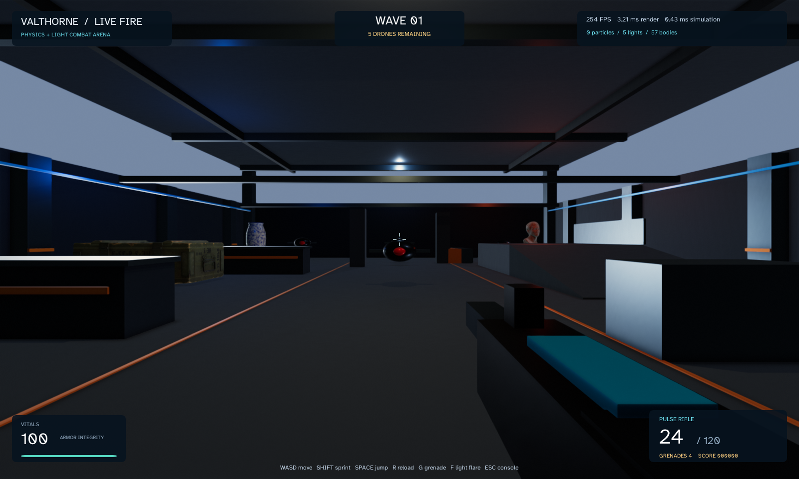
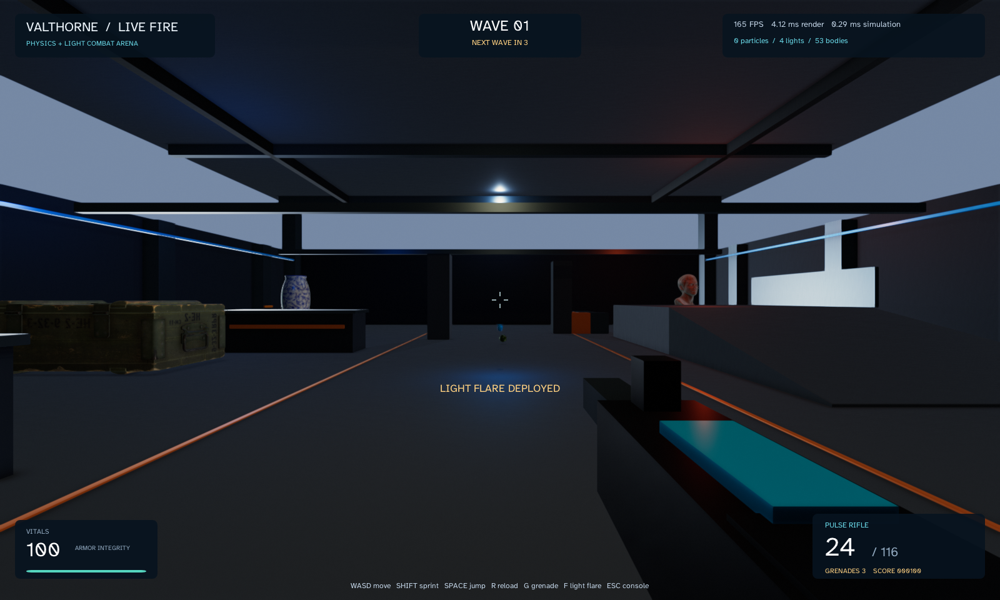
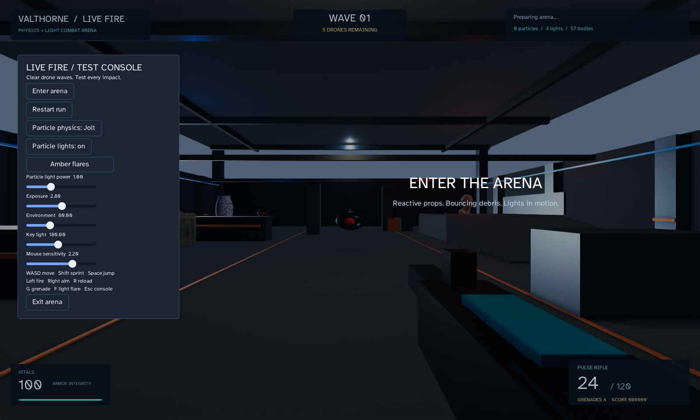

# Live Fire arena: validation and workload measurements

Measured on 2026-09-09, Windows, Java 25.0.2, Ryzen 9 7945HX and an NVIDIA RTX 5070 (driver 610.88). The arena uses JOML, Jolt JNI 6.0.0 and Filament FFM 0.4.0. See the [game and controls](../../fps-arena.md).

## Repeated native workloads

Each configuration ran in three fresh Java processes at 1600×960, Filament High quality, with VSync disabled and the window hidden. Every run used 90 warmup frames followed by 360 measured frames, advancing simulation at 1/60 second per frame. The script turns the camera, fires/reloads, launches flares, throws two grenades and keeps two drones active. Each run validates a living player, finite camera coordinates and no OpenGL errors.

Rendering includes Filament, the HUD and `glFinish`, so GPU work completes before timing ends. Simulation includes the world/effect updates **and the scripted actions**, including weapon rays and particle/body creation. These metrics exclude buffer presentation, operating-system input delivery and some application bookkeeping; their reciprocal is not measured end-to-end FPS. Screenshots are taken after measurement.

| Effects | Render mean ms, across runs (range) | Simulation mean ms, across runs (range) | Render p95 range ms | Peak particles / lights | Final bodies |
| --- | ---: | ---: | ---: | ---: | ---: |
| Jolt + particle lights | 3.789 (3.767–3.812) | 0.346 (0.333–0.359) | 4.426–4.865 | 170 / 15 | 217 |
| Jolt, particle lights disabled | 3.735 (3.599–3.943) | 0.344 (0.316–0.377) | 4.270–4.853 | 170 / 4 | 217 |
| Cosmetic motion + particle lights | 4.104 (3.774–4.442) | 0.183 (0.141–0.220) | 4.529–6.880 | 170 / 15 | 53 |

All configurations kept nine native mesh-cache entries. Four room lights remain active when attached particle lights are disabled. Cosmetic particles follow ballistic motion without collisions; their positions, illumination and occlusion can therefore differ from the Jolt workload.

These are short feature comparisons, not before/after optimization results or confidence intervals. Rendering variation overlaps between configurations; these runs do not establish a reliable rendering speedup from disabling particle lights. Jolt simulation costs more than cosmetic motion in these runs because of the additional native bodies and collision work. The slower cosmetic rendering run illustrates desktop timing variation and different particle placement, not a demonstrated regression. No retained-memory or hardware-instruction reduction is claimed.

Runs were sequential in this order: Jolt/lit, Jolt/unlit, cosmetic/lit; cosmetic/lit, Jolt/lit, Jolt/unlit; Jolt/unlit, cosmetic/lit, Jolt/lit. Other verification and rendering processes were stopped, and the process inventory contained only idle Gradle daemons before measurement. The user's previous arena preview had already closed. This was an ordinary desktop, not a dedicated benchmark machine.

Raw results are the nine `jolt-lit-N.txt`, `jolt-unlit-N.txt`, and `cosmetic-lit-N.txt` files. `sources/`, `source-hashes.json` and `class-hashes.json` preserve the implementation measured. The separate [forked JMH/GC comparison](../particle-lights/README.md) checks the cost of optional light support on existing unlit CPU particle workloads.

```text
./gradlew runFpsArena --args="--benchmark"
./gradlew runFpsArena --args="--benchmark --no-particle-lights"
./gradlew runFpsArena --args="--benchmark --visual-particles"
```

Run each separately, with the visible preview closed. The archived runs launched Java directly with the Gradle-generated example runtime classpath, avoiding a Gradle process during measurement.

## Functional verification

All final suites passed with zero failures and zero skipped tests. Suite counts overlap and must not be added as a unique test total.

| Suite | Checks/tests |
| --- | ---: |
| Standard build tests | 197 |
| 3D geometry/rendering, including native Filament | 84 |
| Jolt physics | 32 |
| UI | 52 |
| Lighting subset | 27 |
| Headless FPS gameplay | 1,349 |
| Light rig editing/persistence | 83 |
| Packaged gallery assets | 6 models |

The physics regressions exercise all 256 user-layer static/dynamic combinations, including disabled pairs, following the pinned JNI bridge correction. Gameplay checks cover movement, jumping, walls, aiming rays, combat, reloading, waves, damage, grenades, ownership and safe flare/muzzle placement near walls. Both cosmetic and physical particle modes are checked for capacity and cleanup.

The final native playthrough uses actual window callbacks and UI buttons to verify movement, jump, mouse look (including captured-coordinate wrap), aim, firing, reload, grenades, colored flares, light/physics toggles, pause/repeat isolation and restart. It reached 62 simultaneous particles and seven lights, verified the previous world closed, and checked that restart clears combat HUD state. See `native-smoke.txt`, `engine-checks.txt`, `game-checks.txt` and `flare-placement-checks.txt`.

The actual framebuffers were inspected after the final checks. The roof and beams frame the arena, imported props render with textures, the HUD/console fit the window, and a moving cyan flare illuminates the floor. This is a procedural test arena with textured props, direct lighting, shadows and static environment reflections; it does not implement dynamic path-traced global illumination.







Release documentation: this is a historical measurement record. Use the [current release checks](../../releasing.md) for building and validating the development snapshot; preserve the recorded source hashes and results.
