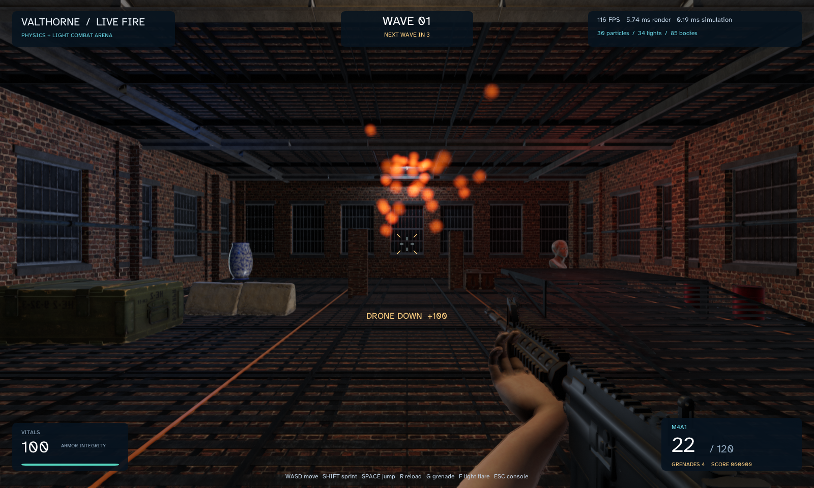
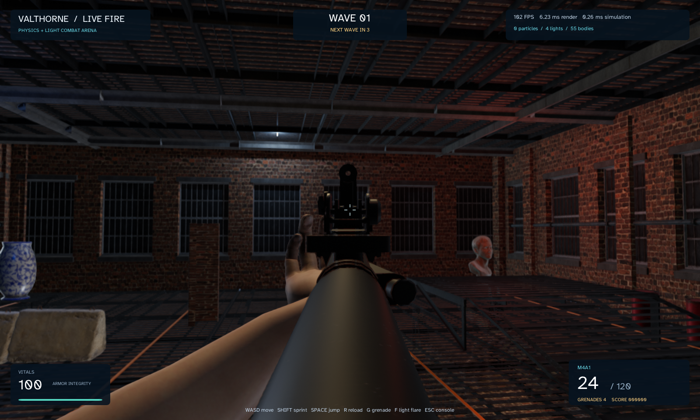
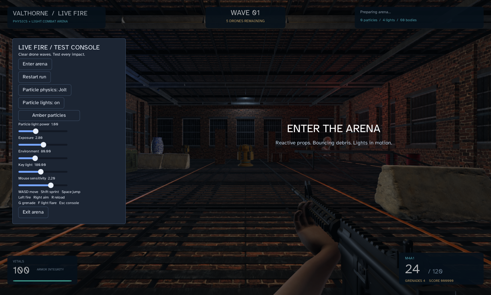

# Realistic FPS assets and transparent particle lights

Measured on 2026-09-09 on Windows, Java 25.0.2, Ryzen 9 7945HX and NVIDIA RTX 5070, driver 610.88. See [the game and controls](../../fps-arena.md).

The package now includes 16 downloaded combat/environment asset entries, plus the existing gallery. The standalone magazine is available for reuse; the game displays the rifle's integrated magazine. Debris and flares use camera-facing quads with a radial opacity mask, visible emission and one explicit moving point light per particle. There is no shot/muzzle light or stationary impact light. The pool is bounded at 96 debris particles and 12 flares. Jolt remains the physics backend.

## Same-scene optimization

Imported OBJ models previously captured and restored OpenGL state on every texture-upload request, even when every texture had already been uploaded. The warm path now rebinds existing textures to their materials without accessing OpenGL. Cold and partially completed uploads retain the original state-preservation path. No extra retained cache is introduced. Disposal still invalidates the model, and caller-modified material textures are restored on the next upload request.

Three fresh-process runs were measured before the change, followed by three after it. The scene, assets, transparent particles, lighting budget and scripted actions were held fixed; only `ObjModel3D.uploadTextures()` changed. The baseline implementation is [preserved here](ObjModel3D-before.java). This is a completed-render macrobenchmark because the eliminated driver calls occur during render submission; JMH alone would not measure their effect on this workload.

| Implementation | Mean rendering ms (range across runs) | Rendering p95 range ms | Mean simulation ms (range across runs) |
| --- | ---: | ---: | ---: |
| Before | 6.935 (6.781–7.235) | 8.098–8.538 | 0.304 (0.285–0.336) |
| Warm texture path | 6.329 (6.278–6.379) | 7.280–7.328 | 0.328 (0.322–0.337) |

The mean of the three rendering means fell by **8.7%**, approximately 0.606 ms. These are short desktop runs, not confidence intervals or a universal speedup. Simulation ranges overlap; no simulation improvement is claimed. All six runs reached 104 particles and 108 lights, ended with 158 bodies, and reported 21 cached meshes at the final frame. The cached-mesh number is a final count, not a recorded peak.

Raw measurements: `obj-before-1.txt` through `obj-before-3.txt`, and `obj-after-1.txt` through `obj-after-3.txt`. The before/after framebuffers are also preserved. The native texture regression removes the thread's LWJGL capabilities during a warm request, proving the path performs no OpenGL calls. It also checks shared texture identity, restoration after a material override, cold-upload graphics state, texture ownership/disposal and the existing textured-OBJ framebuffer regression.

The change avoids transient graphics-state snapshots and driver queries on repeated submissions. These runs do not measure total memory or hardware instruction counts. No whole-engine optimization limit is claimed.

## Other effect configurations

These final-code configurations each ran once, as diagnostic feature comparisons:

| Effects | Render mean / median / p95 ms | Simulation mean / median / p95 ms | Peak particles / lights | Final bodies |
| --- | ---: | ---: | ---: | ---: |
| Jolt, attached lights disabled | 5.860 / 5.681 / 6.929 | 0.323 / 0.293 / 0.563 | 104 / 4 | 158 |
| Cosmetic motion, attached lights enabled | 6.362 / 6.190 / 7.522 | 0.170 / 0.140 / 0.315 | 104 / 108 | 56 |

Both ended with 21 cached meshes. Four room lights remain when particle lights are disabled. Cosmetic motion does not collide, so positions and illumination differ. These single runs do not establish a reliable speedup from either setting. See `jolt-unlit.txt` and `cosmetic-lit.txt`.

The older [procedural arena](../fps-arena/README.md) uses different assets, effects and light counts. Its timings are not a comparable baseline for this scene.

## Method and reproduction

Every run used a hidden 1600×960 window, Filament High quality, VSync disabled, 90 warmup frames and 360 measured frames. Simulation advances by 1/60 second per frame. The script moves the view, fires and reloads, launches flares, throws two grenades and initially places two drones. Rendering includes the HUD and `glFinish`; simulation includes world/effect updates and scripted action costs. Presentation, operating-system input delivery and some application bookkeeping are excluded, so reciprocal timings are not measured end-to-end FPS. Captures occur after timing.

Runs were sequential, with no competing scene previews or validation/benchmark processes; the process inventory showed only an idle Gradle daemon. The host was an ordinary desktop, not a dedicated benchmark machine. Archived runs launched Java directly using the Gradle example runtime classpath.

```text
./gradlew runFpsArena --args="--benchmark"
./gradlew runFpsArena --args="--benchmark --no-particle-lights"
./gradlew runFpsArena --args="--benchmark --visual-particles"
```

Close visible previews before measuring. `sources/` preserves the relevant final sources and material packages; `source-hashes.json` and `class-hashes.json` record their identities. To reproduce the baseline, use these sources with the archived `ObjModel3D-before.java` substituted for `ObjModel3D.java`. Asset manifests and hashes are preserved under `assets/`; the packaged models remain under `src/examples/resources/valthorne/fps-arena`.

## Verification and visual inspection

The final full build and required suites passed, with zero failures/errors/skips. Suite membership overlaps; do not add these as a unique test count.

| Suite | Tests/checks |
| --- | ---: |
| Standard build tests | 200 |
| 3D rendering/geometry, including native Filament | 87 |
| Jolt physics | 32 |
| UI | 52 |
| Lighting subset | 27 |
| Headless FPS gameplay | 1,425 |
| Light rig editing/persistence | 83 |
| Existing packaged gallery models | 6 |
| New combat/environment asset entries | 16 |

The final native smoke test passed real console interactions, movement, jump, mouse look, aim, shooting, reload, grenades, flares, color/light/physics controls, pause/repeat isolation and restart. It reached 51 particles and 55 lights and reported no OpenGL error. Logs are `engine-checks.txt`, `native-smoke.txt`, `particle-alpha-native.txt`, `particle-soft-flecks-validation.txt` and `obj-texture-warm-cache-validation.txt`.

Native alpha regressions check intermediate-opacity source-over compositing, emission masked by texture opacity, transparent corners, exactly one explicit light with implicit emission lighting disabled, illumination following particle motion and cleanup on expiry. Headless checks cover camera-facing orientation, opacity/emission/light fading, safe flare placement and the absence of shot-light births.

The final framebuffer captures were inspected: the M4A1 and posed hands render with textures, the factory modules and props are present, soft transparent flecks are visible, and the HUD reports current particle/light counts. The imported assets use authored albedo plus per-model material values; the current OBJ path does not import normal/roughness maps. Arms are posed geometry rather than runtime skeletal animation. Particle shadows are disabled by default; the four room lights include two shadow casters. Filament uses direct lighting and static environment reflections, not dynamic path-traced global illumination.







Release documentation: this is a historical measurement record. Use the [current release checks](../../releasing.md) for building and validating the development snapshot; preserve the recorded source hashes and results.
