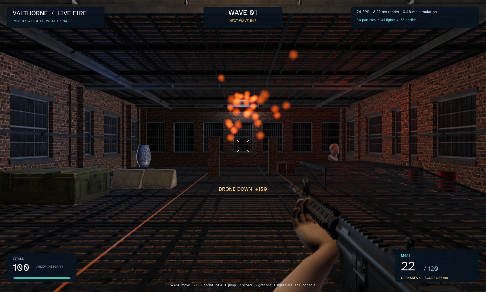

# Reusable scene collection — accepted 2026-09-10

Both Filament and the path tracer now reuse renderer-owned scene collection storage. A matrix is retained per source placement and shared by its OBJ parts. Compatible instance records are reused; each capture still reads mutable transforms/materials and hashes them in the original order. There is no second signature traversal or new dirty-flag requirement. OBJ material expansion and texture rebinding retain their previous behavior.

Inactive records and matrices are removed when the scene shrinks. Collector clear/renderer close and failed collection drop retained collection storage. The path tracer releases and trims packed CPU triangle/BVH/emitter/texture lists in a `finally` block after upload, including failed builds. Independent constructor snapshots remain supported.

## Controlled comparison

Windows, AMD Ryzen 9 7945HX, Java 25.0.2, JMH 1.37, two fresh forks with a 256 MiB heap and GC profiling. The twelve-case comparison uses two 500 ms warmups and three 500 ms measurements per fork. Each operation collects the entire scene and consumes its signature and captured transforms. It excludes BVH building and GPU work. Models are shared; hierarchies have a transformed parent; OBJ placements have two untextured parts. The moving case changes direct-instance positions or the hierarchy parent.

| Placements | Form | Moving | Before µs/op ± error | After µs/op ± error | Before B/op | After B/op |
| ---: | --- | --- | ---: | ---: | ---: | ---: |
| 1 | Direct | No | 0.069 ± 0.005 | 0.055 ± 0.007 | 320.00 | <0.01 |
| 1 | Direct | Yes | 0.105 ± 0.001 | 0.091 ± 0.014 | 320.00 | <0.01 |
| 1 | Hierarchy | No | 0.198 ± 0.006 | 0.192 ± 0.010 | 640.00 | 240.00 |
| 1 | Hierarchy | Yes | 0.202 ± 0.007 | 0.193 ± 0.007 | 640.00 | 240.00 |
| 1 | OBJ | No | 0.151 ± 0.008 | 0.145 ± 0.018 | 552.00 | 256.00 |
| 1 | OBJ | Yes | 0.188 ± 0.014 | 0.186 ± 0.010 | 552.00 | 256.00 |
| 256 | Direct | No | 13.589 ± 0.175 | 12.752 ± 0.428 | 31,416.19 | 66.06 |
| 256 | Direct | Yes | 23.404 ± 0.408 | 21.822 ± 2.194 | 31,416.33 | 110.06 |
| 256 | Hierarchy | No | 30.745 ± 0.877 | 31.899 ± 3.106 | 52,104.43 | 20,560.45 |
| 256 | Hierarchy | Yes | 30.847 ± 1.578 | 30.944 ± 4.090 | 52,104.43 | 20,560.43 |
| 256 | OBJ | No | 34.731 ± 1.078 | 38.612 ± 7.364 | 93,024.49 | 65,648.54 |
| 256 | OBJ | Yes | 49.471 ± 9.773 | 44.977 ± 3.204 | 93,024.69 | 65,648.63 |

The accepted result is lower transient allocation in every case: over 99% for direct scenes, approximately 61–63% for hierarchies, and 29–54% for these OBJ scenes. The two stationary direct cases also have nonoverlapping JMH timing intervals in this short comparison. Most timing intervals overlap; no universal latency or FPS improvement is established.

The short static-OBJ result had a higher candidate mean, so it was checked again with three one-second warmups and five one-second measurements in each of two forks. That focused pair measured **39.775 ± 2.449 → 37.248 ± 3.219 µs/op**, with overlapping intervals. Allocation remained **93,024 → 65,648 B/op**. These measurements do not establish a static-OBJ slowdown or speedup. They also show why the short-run means alone are insufficient for that claim.

Scratch reuse trades some retained CPU storage for less garbage. Live matrices/records and list capacity persist between captures; retired entries lose their references, while backing-list capacity can persist until clear/close. No total-memory, GPU-memory or hardware-instruction reduction is claimed. Per-part OBJ material copies and hierarchy traversal still allocate and remain measurement candidates.

## Isolation and evidence

The original `before.json` and subsequent `before-build-overlap.json` are historical contaminated runs, not this comparison's baseline. After coordinating a build pause with the release task, `isolated-before.json` and `after.json` were collected from frozen classpaths outside `build/`, preventing concurrent cleanup from deleting benchmark classes. The benchmark, scene, node, model-instance, material, OBJ, model-builder and color class files were checked byte-identical between the controlled runs; collection implementation changes were the intended variable.

After the twelve-case pair, the UI task acquired JMH's lock before the focused retest. The attempted retest stopped on the lock error. It was retried only after the UI benchmark finished and that task paused execution. No lock was bypassed and no benchmark processes were run concurrently. Release builds resumed after timing; final functional checks were allowed to run without interpreting their wall-clock performance.

Raw JSON includes per-fork samples, errors, JVM arguments and GC metrics. Text logs are `isolated-before.txt`, `after.txt`, `obj-static-before.txt` and `obj-static-after.txt`. `before-sources/` preserves the baseline collector/harness and initial renderer facade; `after-sources/` contains the final implementation and tests. Source and frozen-class hashes are archived beside them. The benchmark source is unchanged between the compared builds. These are ordinary desktop measurements, not dedicated-host results.

```text
./gradlew benchmarkSceneSnapshot --args="valthorne.graphics.model.SceneSnapshotBenchmark -foe true -prof gc -wi 2 -w 500ms -i 3 -r 500ms -rf json -rff build/reports/scene-snapshot/results.json"
./gradlew benchmarkSceneSnapshot --args="valthorne.graphics.model.SceneSnapshotBenchmark -foe true -prof gc -p count=256 -p kind=obj -p moving=false -rf json -rff build/reports/scene-snapshot/obj-static.json"
```

Create the report directory first when overriding task arguments. The normal task without argument overrides uses the longer annotation settings. Restore the archived baseline collector/renderer sources to compare with the original allocation behavior, and compile each version before running; never compile or launch a preview during measurement. The recorded runs launch Java directly with a frozen Gradle-generated runtime classpath.

## Validation

The nine snapshot contract tests pass, including mutable-input signatures, nested transforms/visibility/reparenting, grow/shrink/empty scenes, OBJ expansion and shared placement behavior, consumer empty-mesh compaction, failure recovery, independent snapshots and packed-data release/rebuild equivalence. See `snapshot-tests.xml` and `candidate-tests.txt`.

The final `build verify3D verifyPhysics3D verifyLighting verifyFpsArena` passed. Reports contain 140 standard tests (zero failures/errors; two optional local MP3/OGG fixture tests skipped), 87 3D tests, 32 Jolt tests, 27 lighting tests and 1,425 headless gameplay checks. Suite counts overlap and release work changed test grouping, so they are not comparable unique totals against earlier reports. All rendering/physics/lighting tests ran without skips. See `integration.txt` and `final-test-summary.json`.

The native FPS smoke test also passed movement, jumping, mouse look, aiming, shooting, reload, grenades, flares, editable light/physics/color settings, pause/repeat isolation and restart. It reached 51 particles and 55 lights, with no OpenGL error. Its framebuffer was inspected; the downloaded scene, transparent glowing particles, moving lights and controls remain present. The screenshot's live timing is not a controlled performance comparison. See `native-smoke.txt`.


